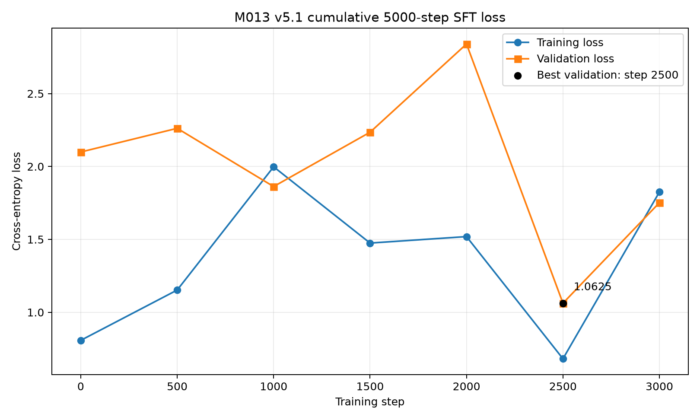

# M013：v5.1 去数学、去污染与严格评估

## 结论先行

本里程碑完成了“去掉数学题”的数据修复，但没有把“数据修复完成”写成“模型能力修复成功”。

- 数据门通过：最终4676条SFT记录中，数学/算术记录为0，数学话题记录为0，冻结评估完整提示及其子串包装重合为0，修复样本跨split语义组泄漏为0。
- 训练门通过：100步安全试跑、2000步正式训练和追加3000步都无NaN/Inf，checkpoint可保存、加载和复测。
- 行为门未通过：累计5000步latest在无数学v2严格评估中为7/30，低于预设的18/30验收线。
- 局部改善：从step2000的4/30提高到7/30；小说事实和证据判断各2/5，通用聊天3/5。
- 剩余失败：小说人物、能力边界和指令遵循仍为0/5，EOS由step2000的29/30降到25/30；因此不再盲目追加同一数据的训练步数。

## 为什么重做v5数据

对M012的7999条v5数据和旧评估做复核后，发现四类结构性问题：

1. 训练数据中仍有720条数学题：M011继承的400条`basic_reasoning`和M012新增的320条`arithmetic_repair`。
2. 大量“别提小说章节”“不要回答”“请原样重复但不要回答”等元提示进入训练，模型会把这些话直接说给用户。
3. 修复答案高度重复，证据题又过度使用萧炎和“A与B”回显，诱发“韩枫和韩枫”一类复制错误。
4. 旧公开30题中有21题与v5 JSONL精确重合，其中15题甚至位于train。`test_records_consumed=0`只能证明隐藏test未训练，不能证明公开诊断题没有泄漏。

因此M013不是单一的“删数学消融实验”，而是一次多因素v5.1数据治理：删除数学和污染任务、冻结无重合评估、按语义组切分修复样本，并重新训练。

## 数据修复结果

基线为M011的5999条混合聊天SFT。清理时按固定优先级删除1684条，再加入361条无数学修复样本，得到4676条。

| 删除原因 | 数量 |
|---|---:|
| 基础算术 | 400 |
| 续写/复述元任务 | 449 |
| 领域切换负面模板 | 285 |
| 污染提示前缀 | 277 |
| 数学话题 | 48 |
| 冻结评估完整提示或子串包装重合 | 225 |
| 合计 | 1684 |

删除原因按固定顺序计数，因此一条同时命中多个条件的记录只计入第一个原因。

| 数据 | train | val | test | 合计 |
|---|---:|---:|---:|---:|
| 清理后的M011基础数据 | 3351 | 477 | 487 | 4315 |
| 新增修复数据 | 278 | 43 | 40 | 361 |
| v5.1最终数据 | 3629 | 520 | 527 | 4676 |

新增修复数据覆盖小说已知实体、小说事实锚点、证据实体抽取、能力边界、概念解释、自然聊天和指令遵循。非指令类修复答案唯一率均为100%；指令遵循类唯一答案率为44%。所有同一`group_id`记录只进入一个split。

机器门禁结果：

| 检查项 | 结果 |
|---|---:|
| 算术记录 | 0 |
| 数学话题记录 | 0 |
| 领域切换记录 | 0 |
| 续写/复述元任务 | 0 |
| 污染提示前缀 | 0 |
| 冻结评估完整提示或子串包装重合 | 0 |
| 修复语义组跨split泄漏 | 0 |

详细数据报告见[data_report.json](data_report.json)，张量报告见[tensor_report.json](tensor_report.json)。原始JSONL和张量体积较大，按项目规则保存在本机并由SHA-256校验，不提交Git。

## 无数学v2严格评估

v2固定为6类×5题，用“指令遵循”替换旧版“基础数学”：

- 小说人物
- 小说事实
- 证据判断
- 能力边界
- 指令遵循
- 通用聊天

评估固定CPU、`temperature=0.3`、`top_k=1`、最多生成30 Token，并要求所有评分项都正常生成`<EOS>`。冻结评估问题在数据构建前注册；规范化后的完整提示，以及把完整提示包进更长问题的形式，与全部train/val/test记录重合为0。同一主题和知识的不同问法会有意保留，因为这套公开诊断衡量的是SFT是否学到目标能力，而不是零样本知识；因此分数不能冒充完全盲测成绩。

M012 step2000在新口径下的基线只有4/30，而不是旧报告中的6/30。这个基线仍来自曾包含评估重合的数据，只用于展示旧模型在更严格规则下的行为，不作为无泄漏能力证明。

## 训练过程

模型仍是M007的8105025参数GPT，SFT每步随机抽1条训练记录，只监督回答和`<EOS>`。

| 阶段 | 初始化 | 本段步数 | 初始验证Loss | 最佳验证Loss | 最终验证Loss |
|---|---|---:|---:|---:|---:|
| smoke | M007预训练best | 100 | 6.8401 | 4.7565 | 4.7565 |
| 正式第一段 | M007预训练best | 2000 | 6.8401 | 2.7157 | 3.2569 |
| 续训第二段 | M013 step2000 latest | 3000 | 2.0992 | 1.0625 | 1.7516 |

第二段checkpoint内部步数从0重新计数，所以`best.pt`里的step 2500对应累计约4500步，`latest.pt`里的step 3000对应累计5000步。验证Loss每次只抽固定数量的随机batch，因此同一个初始化checkpoint在相邻运行中的起始Loss可能不同；这些数字适合判断数值健康和趋势，不应脱离行为评估单独宣布成功。

损失曲线：



## 行为结果

| 模型 | 小说人物 | 小说事实 | 证据判断 | 能力边界 | 指令遵循 | 通用聊天 | 总分 | EOS |
|---|---:|---:|---:|---:|---:|---:|---:|---:|
| M012 step2000旧模型，新v2口径 | 1/5 | 2/5 | 1/5 | 0/5 | 0/5 | 0/5 | 4/30 | 24/30 |
| M013 smoke100 | 0/5 | 0/5 | 0/5 | 0/5 | 0/5 | 3/5 | 3/30 | 29/30 |
| M013 step2000 latest | 0/5 | 2/5 | 1/5 | 0/5 | 0/5 | 1/5 | 4/30 | 29/30 |
| M013累计约4500步best-val | 0/5 | 1/5 | 2/5 | 0/5 | 0/5 | 3/5 | 6/30 | 28/30 |
| M013累计5000步latest | 0/5 | 2/5 | 2/5 | 0/5 | 0/5 | 3/5 | 7/30 | 25/30 |

累计5000步评估连续运行两次，30条答案、通过标记和EOS标记逐项一致，均为7/30，证明greedy复测可复现。评估和展示入口还会比较checkpoint记录的数据摘要与当前张量；split或任务family不一致时直接报错，避免旧模型和新数据混用。

代表性输出：

| 问题 | 累计5000步输出 | 判断 |
|---|---|---|
| 今天天气怎么样？ | 现有资料不足，无法确定。 | 失败；没有说明天气或实时能力边界 |
| 学习Python时总是分心怎么办？ | 把任务切小，关掉干扰，先学习，最后五分钟记录问题。 | 通过；自然聊天改善 |
| 请只回答“收到”。 | 验证集不参与参与参数更新，用来观察模型是否真的泛化。 | 失败；没有遵守精确指令 |
| 萧炎是谁？ | 现有资料不足，无法确定。 | 失败；已知人物仍被过度拒答 |
| 片段中提到的是韩枫和谁？ | 片段中的两个人是紫研。 | 通过；能抽取第二实体 |

完整结果见[累计5000步严格评估](category_eval_cumulative5000_v2_greedy.md)和[固定小说/非小说样本](novel_vs_general_cumulative5000_samples.md)。

## 验收判断与下一步

M013的准确结论是：

- “去掉数学题”已完成，并有数据扫描、任务family计数和回归测试三重证据。
- 元提示污染、冻结评估完整提示及子串包装重合、修复样本跨split泄漏已修复；同主题的不同问法仍有意保留，不把本分数称为完全盲测。
- 800万参数模型在更干净数据上改善了部分小说事实、证据抽取和自然聊天，但EOS与能力边界并未稳定改善。
- 30题行为能力仍未达到18/30门槛，不能发布为可靠聊天模型。

下一轮不再恢复数学题，也不继续盲目增加同一数据的step。优先动作应是：为精确指令、证据中第二实体抽取、已知小说人物和事实分别准备更多结构正确且答案多样的数据；先做小规模对照训练，只有分类分数提高后才扩大训练。

## 日志与独立调试

构建、训练、评估和绘图均使用带时间戳、`run_id`和模块名的JSONL日志。日志位于本目录的`logs/`，按`data`、`validation`、`checkpoint`、`sft`、`orchestrator`等模块分文件；评估和展示的checkpoint/数据兼容性检查也记录在`validation`日志中。可只查看某一模块，例如：

```bash
rg '"level": "ERROR"' reports/milestones/013_v5_1_no_math_sft/logs/*.validation.jsonl
```

模块可在调用`configure_module_loggers`时分别设为`DEBUG`、`INFO`、`WARNING`或`OFF`；轮转大小和保留份数来自正式配置。默认不记录问题正文、答案正文、密码、Token或授权头，详细debug未在本次正式运行中开启。关键成功路径由数据门禁、checkpoint重载、重复greedy评估和测试覆盖；异常会记录操作名与堆栈后继续抛出，不静默吞错。

关键文件校验见[SHA256SUMS.md](SHA256SUMS.md)。
