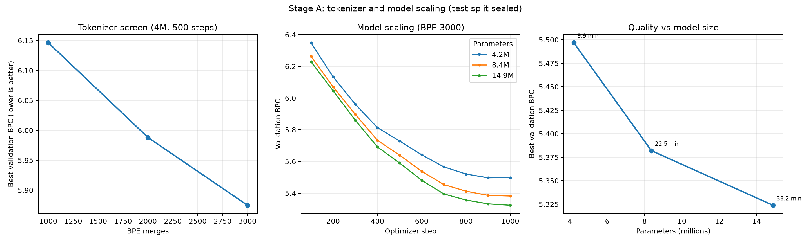

# M015：Stage A 分词器与模型容量实测

## 结论

第一步已经完成。固定《斗破苍穹》v4训练语料、Context 512、每步4096 Token、随机种子和优化器后，实测得到两项结论：

1. 3000 merges 的 BPE 在本轮三个候选中最好；验证 BPC 为5.8747。
2. 1488万参数模型在本轮三个容量中质量最好；验证 BPC 为5.3239。836万参数是本机迭代的效率甜点，验证 BPC 为5.3820。

1488万比836万的验证BPC只改善约1.08%，但耗时增加约70%。所以“最大质量分支”选择1488万，“高频本机实验分支”保留836万。1488万是当前**实测范围内**的最大质量模型，不等于已经证明它是语料的绝对参数上限。

## 为什么改用BPC

不同BPE会把同一段文字切成不同数量的Token，Token Loss不能直接横向比较。BPC（Bits Per Character）把Token Loss换算成每个原始字符所需的信息量；数值越低，模型对同一份文字的预测越好。因此本轮用验证BPC选型，同时保留原始Token Loss供单个实验内部观察。

## 实验隔离

- BPE合并统计只使用train；validation/test字符只用于基础字符覆盖，不进入合并频次。
- 三个分词器写入独立目录，不覆盖正式v4数据。
- 模型选择只读取train和validation；训练报告中`test_evaluated=false`，训练入口不会加载test张量。
- BPE筛选固定4M主体、500步；模型筛选固定BPE 3000、1000步。
- 三个模型每步均处理4096 Token，共暴露4,096,000训练Token，约为训练语料的1.27遍。

## BPE筛选结果

| BPE merges | 词表 | 训练Token | 字符/Token | 实际参数 | 最佳验证BPC | 用时 |
|---:|---:|---:|---:|---:|---:|---:|
| 1000 | 5,465 | 3,756,042 | 1.4666 | 3,819,161 | 6.1465 | 5.3分钟 |
| 2000 | 6,465 | 3,416,400 | 1.6124 | 4,012,161 | 5.9882 | 5.9分钟 |
| 3000 | 7,465 | 3,223,207 | 1.7091 | 4,205,161 | **5.8747** | 5.3分钟 |

3000 merges相对2000 merges改善约1.89%，相对1000 merges改善约4.42%。它增加词表与Embedding参数，但减少序列长度，并在相同训练Token预算下取得最低验证BPC。

## 模型容量筛选结果

| 配置 | Embedding | 层 | 头 | 实际参数 | 最佳Step | 最佳验证BPC | Token/参数 | 速度 | 用时 |
|---|---:|---:|---:|---:|---:|---:|---:|---:|---:|
| 4M | 192 | 6 | 6 | 4,205,161 | 900 | 5.4969 | 0.974 | 6916 Token/s | 9.9分钟 |
| 8M | 256 | 8 | 8 | 8,362,025 | 1000 | 5.3820 | 0.490 | 3035 Token/s | 22.5分钟 |
| 14M | 320 | 10 | 8 | 14,880,745 | 1000 | **5.3239** | 0.275 | 1785 Token/s | 38.2分钟 |

4M到8M改善约2.09%；8M到14M继续改善约1.08%。三者的train/validation BPC差距都很小，14M在第1000步仍创新低，说明当前1000步筛选没有出现明显过拟合，但更大的模型明显处于训练Token不足状态。



## 样本边界

1000步只是容量筛选，不是正式预训练。固定提示“萧炎微微一笑，”的输出仍不流畅：

| 模型 | 1000步输出开头 |
|---|---|
| 4M | `其，“我你他他的长老却是在药老！”……` |
| 8M | `“若是他与薰儿，至于那场，至于他们……”` |
| 14M | `“这个时候。”第三天山红雷光印……` |

因此本轮只能回答“哪个配置更值得正式训练”，不能把1488万模型称为已经训练完成，更不能用BPC替代流畅度、重复率、人物一致性和问答正确率验收。

## 下一步

最大质量路线使用3000 merges、1488万参数，从随机权重进行正式预训练；建议先跑6000步，每250步评估，连续三个验证点改善小于0.01或生成Harness恶化时停止。按本轮实测速度，6000步约需3.8小时，温控降速时应预留更长时间。

正式预训练后必须重新进行SFT；旧810万参数、2000 merges的checkpoint不能直接装入新的词表和网络形状。SFT通过后再评估是否需要偏好优化；章节细节与关系链仍优先使用检索增强，而不是要求参数模型死记全书。

## 复现与调试

- 分词日志：`reports/milestones/015_scaling_stage_a/logs/bpe_*/`，按learning、encoding、validation分开。
- 训练日志：各本机`runs/scaling_a/*/logs/`，按data、pretrain、validation、checkpoint、gpu和orchestrator分开。
- 日志均为JSONL，包含UTC时间、级别、模块和run_id；单文件轮转上限10MB，保留5份，不记录密码或Token。
- 单独调试某模块可用`rg '"level": "ERROR"' <日志目录>`或只打开对应模块JSONL。
- 训练权重、Token张量和运行日志仅保存在本机并被Git忽略；汇总JSON、CSV、Markdown、PNG和SVG进入版本管理。

机器可读材料：

- [Tokenizer汇总](tokenizer_screen_summary.json)
- [模型汇总](model_screen_summary.json)
- [曲线数据](model_bpc_curves.csv)
- [SVG曲线](scaling_stage_a.svg)

验证命令：

```bash
.venv/bin/python -m unittest tests.test_prepare_bpe_v4 tests.test_train_pretrain_v4 tests.test_analyze_scaling_stage_a tests.test_plot_scaling_stage_a tests.test_gpt_model_v4
```

本轮结果：15项相关测试、240项全项目测试全部通过。
