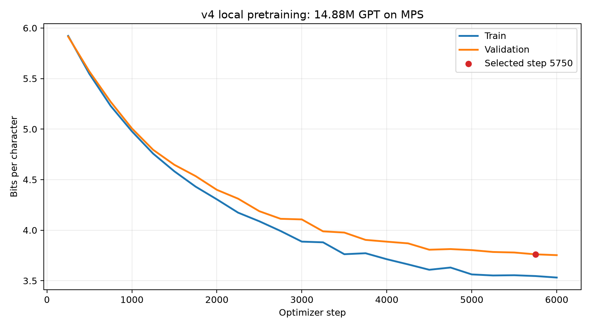

# M016：1488万参数正式预训练

## 结论

1488万参数、BPE 3000 的模型已从随机权重完成6000步正式预训练。训练全程只使用train，checkpoint选择只使用validation；test张量未加载、未评估。

正式SFT初始化点选择 **Step 5750**，而不是机械使用最后一步。Step 6000的原始验证BPC最低，但只比Step 5750改善0.0081，小于预先冻结的0.01有效改善门槛；独立重载生成时，Step 5750通过机械Harness，而Step 6000因一条续写过早EOS导致平均长度不足而被标记为`REVIEW`。

这次验收只说明模型已经形成可用于SFT的小说语言基座，不说明它是成熟小说生成器或聊天模型。固定样本的段落形态和领域词汇明显改善，但仍存在语病、重复、角色关系跳跃和章节标题式输出。

## 冻结参数

| 项目 | 值 |
|---|---:|
| 参数量 | 14,880,745 |
| BPE merges / 词表 | 3,000 / 7,465 |
| Embedding / Blocks / Heads | 320 / 10 / 8 |
| FFN / Context | 1,280 / 512 Token |
| Micro Batch / 梯度累积 | 2 / 4 |
| 每优化步Token | 4,096 |
| 学习率 | 3e-4 warmup，cosine降至3e-5 |
| Weight Decay / Betas | 0.1 / 0.9, 0.95 |
| 设备 / 精度 | Apple MPS / float32 |
| 随机种子 | 42 |

## 训练结果

| 指标 | 结果 |
|---|---:|
| 最终Step | 6,000 |
| 选中Step | **5,750** |
| 选中验证Loss / BPC | 4.4576 / **3.7612** |
| Step 6000验证Loss / BPC | 4.4480 / 3.7532 |
| Step 250 → 5750验证BPC改善 | 36.41% |
| 训练Token暴露量 | 24,576,000 |
| 相对train Token遍数 | 7.62倍 |
| Token/参数 | 1.652 |
| 总用时 | 5,513秒，约91.9分钟 |
| Test参与 | **否** |

曲线中的红点是正式选择的Step 5750。BPC在前半段快速下降，3000步后进入平台和间歇性改善；这也是采用“连续三个评估点改善不足0.01才停止”，而不是看到一次波动就停止的原因。

## 为什么选Step 5750

| 候选 | 验证BPC | 独立Harness | 平均长度 | 4-gram重复率 | 最长连写 | 决策 |
|---:|---:|---|---:|---:|---:|---|
| 5750 | 3.7612 | PASS | 100.0 | 0.0254 | 4 | **SELECT** |
| 6000 | 3.7532 | REVIEW | 85.4 | 0.0548 | 4 | 备选留档 |

Step 6000的BPC只低0.0081，低于有效改善门槛，而且独立固定种子样本出现一条短输出和一条章节标题式续写。Step 5750的五条独立样本均达到100字，所有机械门槛通过，因此按预先定义的“验证筛选 + Harness否决 + 人工语义复核”协议选择Step 5750。

自动Harness只能发现长度、中文比例、重复、单字连写和疑似原文复现，不能判断语法、连贯性或人物事实。人工抽样后，Step 5750仍有“内院的内院”“个个个年轻人”“炼药师炼药师”等问题，所以它只被接受为SFT初始化点。

## 两个候选的独立样本

| 提示词 | Step 5750 | Step 6000 |
|---|---|---|
| 萧炎微微一笑， | `道：““磐门，“磐门”可要比赛“火能”的新生”…` | `手掌缓缓抚起，手掌猛的一握，一团火焰…` |
| 夜色笼罩着山谷， | `随着时间的推移，那山顶处，有着几道黑影人群…` | `随着时间的寂静，周围那山壁处那巨大的山壁…` |
| 望着眼前的黑袍少年， | `略微噙着一抹冷笑，道：“没想到你竟然也没资格？”…` | `脸庞上浮现一抹笑意…“我知道你对我好好好。”…` |
| 药老沉吟片刻，道： | `回事之后，萧炎将药老给了回去…` | `第一百八十七章 六品…第三百六品…` |
| 广场之上，无数道目光 | `中，有着一道苍老声音响起…` | `都是投射而退，整片天地。“咳...”` |

完整120条训练期样本和所选候选独立样本见`fixed_prompt_samples.md`；Step 6000独立样本见`comparison_step6000_no_test.json`。

## 训练安全与调试

- 训练前完成3步MPS冒烟和完整checkpoint重载，243项全项目测试通过。
- 日志按data、pretrain、validation、checkpoint、gpu和orchestrator模块分开，JSONL包含UTC时间、run_id和结构化上下文。
- 日志单文件10MB轮转、保留5份；不记录密码、Token、密钥或完整授权头。
- 每250步保存并重新加载校验checkpoint；SIGTERM/异常路径另有emergency checkpoint机制。
- 日志查看：`runs/formal_pretrain_14m_bpe3000_6000/logs/`；按模块调试可只打开对应JSONL，或用`rg '"level": "ERROR"'`筛选错误。

## 素材索引

- `pretrain_v4_report.json`：24个验证点和完整训练指标。
- `pretrain_v4_loss.csv`：Loss、BPC、学习率和时间。
- `pretrain_v4_loss_curve.png` / `.svg`：视频曲线。
- `selected_model_evaluation.json`：Step 5750独立重载样本，明确`test_evaluated=false`。
- `comparison_step6000_no_test.json`：Step 6000独立对照。
- `candidate_selection.json`：机器可读的候选决策。
- `story_harness_report.json` / `.csv`：全程固定样本机械指标。
- `fixed_prompt_samples.md` / `story_harness_samples.md`：完整文本材料。
- `SHA256SUMS.md`：归档文件及本机checkpoint摘要。

## 下一步

从Step 5750的1488万参数checkpoint重新进行v5.2.2 SFT。新模型的词表和网络形状都与旧810万模型不同，因此不能复用旧SFT权重或optimizer；可以复用经过审核的SFT文本，但必须用BPE 3000重新编码，并先做20步安全试跑。SFT行为门通过后再考虑DPO；当前不做PPO式RLHF。
