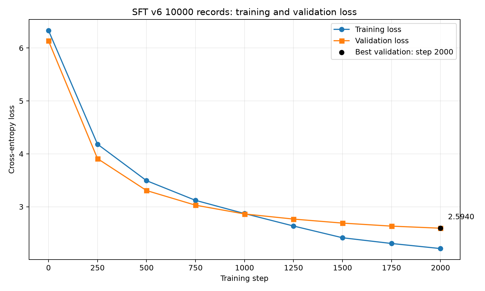

# M018：一万条 SFT v6 构造、审计与正式训练

## 结论

本轮完整执行了“一万条数据构造 → 独立数据检查 → 多轮 BPE 编码 → MPS 冒烟 → 2,000 步正式 SFT → 公开诊断”。训练链路成功，结构与隔离门槛全部通过；当前轮次选用 **Step 2000**，因为它在未参与训练的公开诊断集上优于 Step 1250。

模型仍然**没有通过行为发布门**。验证 Loss 明显下降，但固定问答和公开生成仍有错实体、模板串题、无关回答与重复；因此本里程碑只能表述为“正式 SFT 已完成，当前数据可学习”，不能表述为“聊天模型已经达标”。密封测试集 600 条全程未读取、未生成、未用于选模。

## 一万条数据

| 项目 | 结果 |
|---|---:|
| 总记录 | 10,000 |
| train / val / public / sealed | 8,000 / 800 / 600 / 600 |
| 小说实体与事实 | 3,300 |
| 长证据阅读 | 2,000 |
| 自然聊天与多轮 | 1,500 |
| 摘要、改写、续写 | 1,000 |
| 格式与长度控制 | 900 |
| 项目与通用概念 | 800 |
| 纠错、未知与边界 | 500 |
| 多轮记录 | 1,000 |
| 128–384 Token 长证据 | 2,068 |
| 覆盖章节 / 人物 / 概念 | 1,597 / 70 / 256 |

正式小说证据只来自 `data/cloud_v4/train.txt`，每条记录保存原文行号、章节、文本和 SHA-256。通用部分为本项目人工规则构造，不冒充小说原文证据。

## 独立数据检查

| 硬门槛 | 结果 |
|---|---:|
| 精确问题重复 / 规范化问题重复 | 0 / 0 |
| 语义组 / 章节 / 证据跨 split 泄漏 | 0 / 0 / 0 |
| BPE 无法编码 | 0 |
| 超过 512 Token | 0 |
| 数学题 / 元包装 / 待审核 | 0 / 0 / 0 |
| 回答括号错误 | 0 |
| 最大通用答案重复 | 1 |
| 拒答比例 | 1.02% |
| train 监督 Token | 337,900 |
| 全部序列 Token | 1,203,615 |
| 记录级风险 | 0 |

第一次审计曾正确阻断训练：发现254条词表外字符、5条源文本结构噪声、规范化重复、证据跨集合重复、数学误报和监督量不足。修复后重新从源数据构造，而不是直接手改最终 JSONL；最终验证报告状态为 `passed`。

## 编码规则

每条对话按 `<BOS><USER>问题<ASSISTANT>回答<EOS>` 串联。多轮记录会继续追加 `<USER>...<ASSISTANT>...<EOS>`；所有用户内容和角色标记的标签均设为 `-100`，每一轮助手正文与 EOS 才计算监督 Loss。

| 指标 | 结果 |
|---|---:|
| BPE 词表 | 7,465 |
| 最短 / 最长序列 | 19 / 389 Token |
| 总监督 Token | 423,628 |
| 总遮罩 Token | 769,987 |
| 密封测试消耗 | 0 |

## 正式训练

| 项目 | 值 |
|---|---:|
| 初始化权重 | 正式预训练 Step 5750 |
| 参数量 | 14,880,745 |
| Embedding / Blocks / Heads | 320 / 10 / 8 |
| Context | 512 Token |
| Batch / Step | 4 / 2,000 |
| 学习率 / Weight Decay | 2e-5 / 0.05 |
| 采样 | 8,000 条无放回一轮 |
| 设备 / 精度 | Apple MPS / float32 |
| 总用时 | 629.96 秒，约 10.5 分钟 |
| 训练覆盖率 | 100% |

正式训练从原始预训练权重重新开始，没有沿用2步冒烟权重，也没有复用旧 SFT optimizer。

| Step | 固定训练 Loss | 完整验证 Loss | 旧30题 | EOS | 覆盖率 |
|---:|---:|---:|---:|---:|---:|
| 0 | 6.3311 | 6.1353 | 0/30 | 2/30 | 0% |
| 250 | 4.1823 | 3.9095 | 2/30 | 19/30 | 12.5% |
| 500 | 3.4930 | 3.3063 | 1/30 | 11/30 | 25% |
| 1,000 | 2.8710 | 2.8635 | 1/30 | 13/30 | 50% |
| 1,250 | 2.6355 | 2.7667 | 3/30 | 11/30 | 62.5% |
| 1,500 | 2.4136 | 2.6907 | 1/30 | 12/30 | 75% |
| 1,750 | 2.3054 | 2.6335 | 1/30 | 11/30 | 87.5% |
| 2,000 | **2.2093** | **2.5940** | 1/30 | 5/30 | 100% |

## 公开诊断与选模

旧训练器的 `best.pt` 按历史30题规则停在 Step 1250，但该规则与本轮12个任务 family 不完全匹配。为避免被单一旧指标误导，新增公开诊断：对600条公开记录计算完整 teacher-forced Loss，并从各 family 固定抽样生成；sealed split 不进入内存中的评估列表。

| 候选 | 公开 Loss | EOS | 完全一致 | 平均文本相似度 | 结论 |
|---:|---:|---:|---:|---:|---|
| 1,250 | 2.8050 | 87.5% | 0% | 0.233 | 不选 |
| 2,000 | **2.6331** | **95.8%** | 0% | **0.304** | **本轮选择** |

Step 2000 在四项公开指标中均不差于 Step 1250，因此选择 `runs/sft_v6_10000_step2000/checkpoints/step_02000.pt`。这只是**当前轮次最佳**，不是发布通过；0%完全一致和低相似度是明确失败信号。

### 实际样本

| 输入 | Step 1250 | Step 2000 | 判断 |
|---|---|---|---|
| 药尘是谁？ | `可以先记住药尘，药尘是小说中的重要人物。` | `可以先记录问题：药尘是小说中的重要人物。` | 局部正确但模板化 |
| 萧炎是谁？ | `可以先记住：萧炎：人物` | 出现药老与“类型”重复 | 2000退化 |
| 今天天气怎么样？ | 错答萧炎 | 给出学习建议 | 两者均未学会实时边界 |
| 今天如何学习？ | 错答云岚宗 | 给出可执行建议 | 2000改善 |
| 监督微调是什么？ | 无关学习模板 | 无关复习模板 | 两者均失败 |

完整固定样本见 `samples_step1250.md` 与 `samples_step2000.md`；按 v6 family 抽样的公开结果见 `public_eval_step1250.md` 与 `public_eval_step2000.md`。

## 为什么没有继续盲目训练

验证 Loss 一直下降，只能说明模型更会预测这套 SFT 答案。实际生成显示自然聊天的高频句式“可以先……”和小说提取模板互相污染，模型还不能稳定判断任务类型；继续在同一配比上堆 Step，可能进一步记住模板，而不是提高通用回答质量。

下一轮应先重构自然聊天数据的答案多样性、提高核心直接问答与能力边界的有效权重、减少机械抽取任务对生成风格的支配，并建立与 v6 各 family 对齐的规则评分。数据修复后应从预训练 Step 5750 重新 SFT，不能从本轮模板偏置权重继续训练。

## 日志与独立调试

- 数据构造：`logs/sft_v6_build/`
- 独立审计：`logs/sft_v6_validation/`
- 张量编码：`logs/sft_v6_tensor/`
- 冒烟训练：`runs/sft_v6_smoke/logs/`
- 正式训练：`runs/sft_v6_10000_step2000/logs/`
- 公开评估：本目录 `logs/`

日志为 JSONL，含 UTC 时间和 `run_id`；data、sft、validation、checkpoint、orchestrator 等模块分文件保存，单文件10MB、保留5份。默认 INFO；可用环境变量独立调节，例如 `GPT_LOG_LEVEL_SFT=DEBUG`、`GPT_LOG_LEVEL_DATA=OFF`。筛错示例：`rg '"level": "ERROR"' runs/sft_v6_10000_step2000/logs`。日志格式器默认遮盖密码、密钥、Token、Cookie 和 Authorization。

## 关键哈希

| 文件 | SHA-256 |
|---|---|
| SFT v6 JSONL | `6e1d6380a46dce6586dc1dbc28e7f52ebbd76c91fd604a0ec03d5900b3bc3876` |
| SFT v6 张量 | `36188f740f88e0f396bc385b11ece8a09b9729c83755e512aeb11da07dbd0ab0` |
| Step 2000 checkpoint | `c78fe61bdcc1b86d2c8447db2b45862cd247798e9c7e6110b6b0065c7818a54a` |

## 主要材料

- `build_report.json` / `build_samples.md`：构造规模与分维度样本。
- `validation_report.json`：独立硬门槛结果。
- `tensor_report.json`：多轮 BPE 编码与监督遮罩指标。
- `smoke_train_report.json`：2步隔离冒烟。
- `formal_train_report.json` / `formal_train_report_loss.csv`：正式训练完整历史。
- `sft_v6_loss_curve.png` / `.svg`：视频用曲线。
- `public_eval_step1250.*` / `public_eval_step2000.*`：公开选模依据。
- `selection.json`：机器可读的当前轮次选择与发布门状态。
